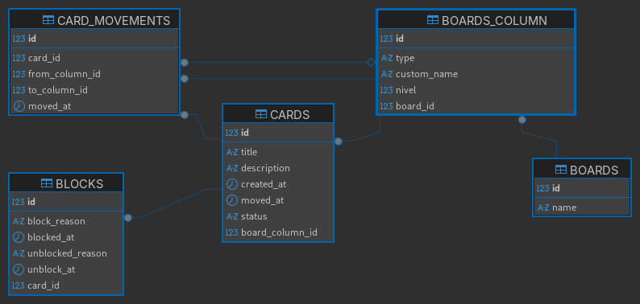
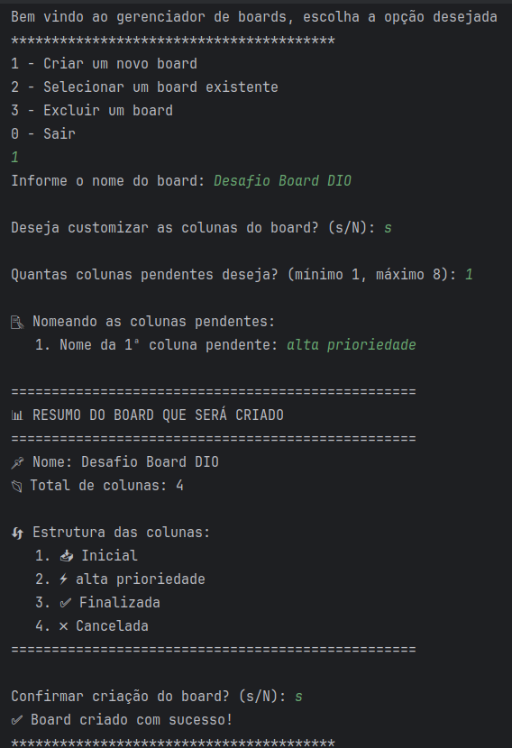
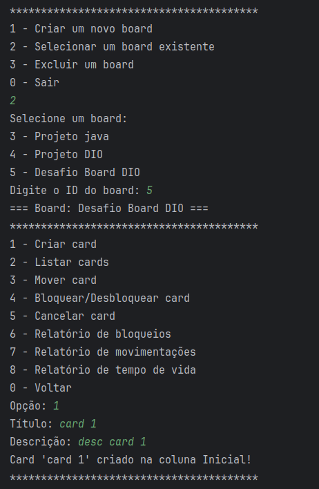
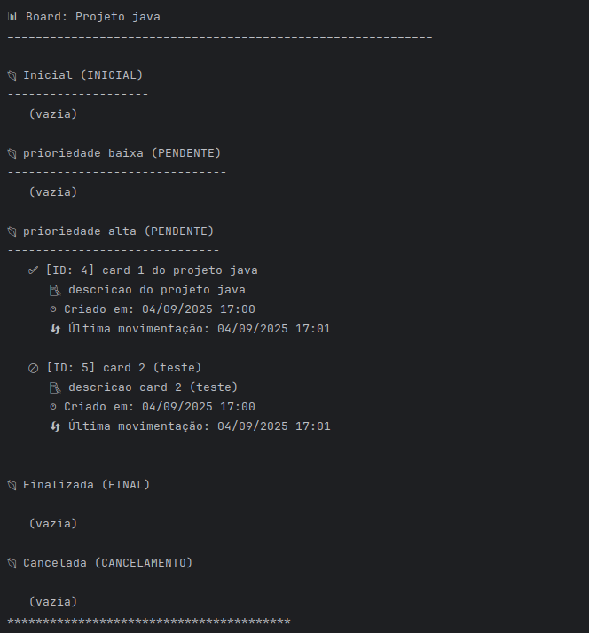
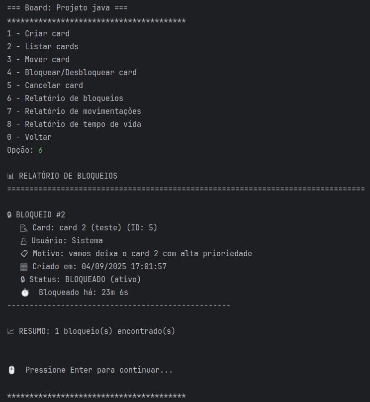
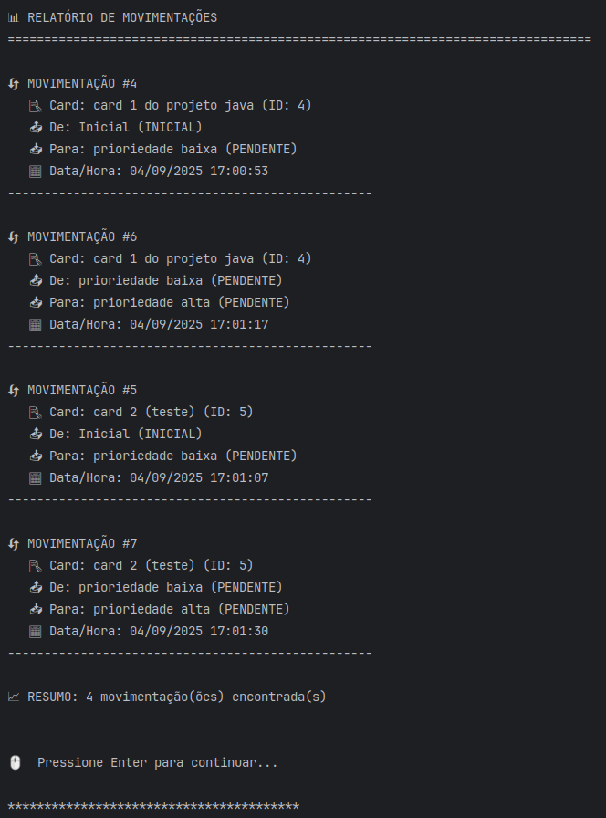
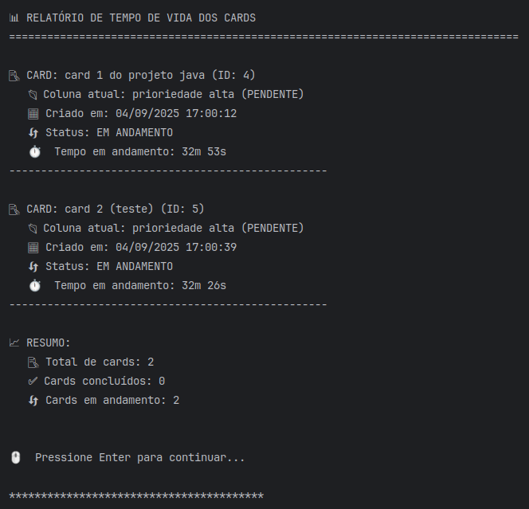

# Board - Sistema de Gerenciamento de Tarefas

Sistema de gerenciamento de tarefas tipo Kanban desenvolvido em Java para fins didáticos como parte do desafio da Digital Innovation One (DIO).

## Descrição

Aplicação de linha de comando que implementa um sistema completo de boards customizáveis para acompanhamento de tarefas. Utiliza arquitetura em camadas (DAO/Service/UI) com persistência em MySQL e controle de migração via Liquibase.

---

## Especificações Técnicas

| Componente | Versão/Tecnologia |
|------------|-------------------|
| Java | OpenJDK 21 LTS |
| Build Tool | Gradle 8.14 |
| Database | MySQL 8.3.0 |
| Migration | Liquibase 4.33.0 |
| Container | Docker |
| Architecture | Layered (DAO/Service/UI) |

---

## Diagrama do Banco de Dados

| Schema ER - Modelo Relacional            |
|------------------------------------------|
|  |

---

## Screenshots do Sistema

### Operações Principais

| Função               | Tela                                            |
|----------------------|-------------------------------------------------|
| **Criar Board**      |  |
| **Criar Card**       |    |
| **Visualizar Board** |          |

### Relatórios do Sistema

| Relatório                     | Output                                              |
|-------------------------------|-----------------------------------------------------|
| **Histórico de Bloqueios**    |        |
| **Movimentações de Cards**    |  |
| **Tempo de Vida das Tarefas** |    |
---

## Funcionalidades do Sistema

### Menu Principal
- [x] Criar novo board
- [x] Selecionar board existente  
- [x] Excluir board
- [x] Sair do sistema

### Menu do Board
- [x] Criar card
- [x] Listar cards por coluna
- [x] Mover card entre colunas
- [x] Bloquear/Desbloquear card
- [x] Cancelar card
- [x] Relatório de bloqueios
- [x] Relatório de movimentações
- [x] Relatório de tempo de vida

### Regras de Negócio
- [x] Estrutura obrigatória: INICIAL → PENDENTE(s) → FINAL → CANCELAMENTO
- [x] Navegação sequencial entre colunas (exceto cancelamento)
- [x] Cards bloqueados não podem ser movidos
- [x] Histórico completo de movimentações
- [x] Controle de bloqueios com motivos

---

## Requisitos do Sistema

### Software Necessário
```
Java 21+ (OpenJDK recomendado)
Docker e Docker Compose
Git
```

### Verificação de Versões
```bash
java -version    # deve ser 21+
docker --version
git --version
```

---

## Como Executar

### 1. Clonar o Repositório
```bash
git clone [URL_DO_REPOSITORIO]
cd board
```

### 2. Iniciar o Banco de Dados
```bash
docker compose -f docker-compose-mysql.yml up -d
```

### 3. Compilar a Aplicação
```bash
./gradlew build
```

### 4. Executar o Sistema
```bash
./gradlew run
```

### 5. Parar o Banco (quando terminar)
```bash
docker compose -f docker-compose-mysql.yml down
```

---

## Estrutura do Projeto

```
src/main/java/tech/
├── Main.java                          # Ponto de entrada
├── joaovic/
│   ├── persistence/
│   │   ├── config/
│   │   │   └── ConnectionConfig.java   # Configuração do banco
│   │   ├── dao/                       # Data Access Objects
│   │   ├── entity/                    # Entidades JPA
│   │   └── migration/                 # Estratégia de migração
│   ├── service/                       # Lógica de negócio
│   └── ui/                           # Interface do usuário
└── resources/
    └── db/changelog/                  # Scripts Liquibase
```

---

## Modelo de Dados

### Tabelas Principais

| Tabela | Descrição | Relacionamento |
|--------|-----------|----------------|
| `BOARDS` | Boards do sistema | 1:N com BOARDS_COLUMN |
| `BOARDS_COLUMN` | Colunas dos boards | 1:N com CARDS |
| `CARDS` | Cards/tarefas | 1:N com BLOCKS |
| `BLOCKS` | Histórico de bloqueios | N:1 com CARDS |
| `CARD_MOVEMENTS` | Histórico de movimentações | N:1 com CARDS |

### Tipos de Coluna
```
INICIAL      - Coluna onde cards são criados (única)
PENDENTE     - Colunas de trabalho (múltiplas permitidas)
FINAL        - Coluna de conclusão (única)
CANCELAMENTO - Coluna de cancelamento (única)
```

---

## Configuração

### Arquivo .env
```env
DB_URL=jdbc:mysql://localhost:3306/board_db
DB_USER=board_user
DB_PASSWORD=board_user_password
MYSQL_PORT=3306
```

### Conectividade
- **MySQL**: localhost:3306
- **Database**: board_db
- **Charset**: UTF-8

---

## Comandos Úteis

### Desenvolvimento
```bash
# Compilar apenas
./gradlew compileJava

# Executar testes
./gradlew test

# Limpar build
./gradlew clean
```

### Banco de Dados
```bash
# Conectar ao MySQL via Docker
docker exec -it board-db mysql -u board_user -p board_db

# Ver logs do container
docker logs board-db

# Status dos containers
docker ps
```

---

## Status do Projeto

**Versão:** 1.0-SNAPSHOT  
**Status:** Completo ✅  
**Propósito:** Educacional (DIO)  

### Funcionalidades Implementadas
- ✅ CRUD completo de boards e cards
- ✅ Sistema de bloqueio com histórico
- ✅ Relatórios detalhados
- ✅ Migração automatizada do banco
- ✅ Arquitetura em camadas
- ✅ Validação de regras de negócio

---

## Autor

Desenvolvido por [João Victor 🥷](https://github.com/joaovic-tech/) para o desafio da Digital Innovation One (DIO)
