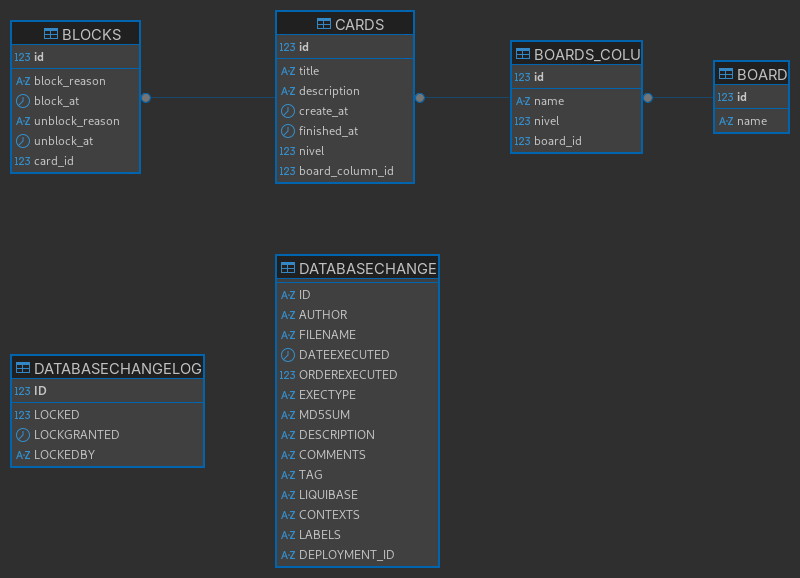

- [x] Mover Cards - É fundamental para o fluxo do kanban
- [x] Bloquear/Desbloquear - Completa o sistema básico de gestão
- [x] Cancelar Cards - Funcionalidade adicional do menu
- [ ] Boards Customizáveis - Melhoria de UX
- [ ] Relatórios - Features avançadas

---

# Documentação do projeto (o que entendi)

| Esboço da aplicação                                   | Diagrama de entidade                 |
|-------------------------------------------------------|--------------------------------------|
|  |  |

---

### Tipos e Ordem das Colunas (Regras da DIO)
Os boards são compostos por 4 tipos de colunas: `Inicial`, `Pendente`, `Final` e `Cancelamento`.

1.  **Coluna Inicial:** Apenas uma por board. É sempre a **primeira** coluna.
2.  **Colunas Pendentes:** Pode haver várias. Ficam entre a coluna `Inicial` e `Final`. Exemplos: "Em Andamento", "Revisão", "Concluída".
3.  **Coluna Final:** Apenas uma por board. É sempre a **penúltima** coluna.
4.  **Coluna de Cancelamento:** Apenas uma por board. É sempre a **última** coluna.

---

### Ações de alterar card de coluna
A movimentação de cards deve seguir a ordem das colunas no board, sem pular nenhuma etapa.

**Exemplo de fluxo padrão:**
`Inicial` -> `Pendente 1` -> `Pendente 2` -> `Final`

**Exceção da Regra:**
*   Um card pode ser movido para a coluna de **Cancelamento** a partir de **qualquer outra coluna**, exceto a coluna `Final`.

> Atenção: Uma vez na coluna `Final` ou `Cancelamento`, o card não pode ser movido.

---

### Relacionamentos
1. BOARDS (1:n) BOARDS_COLUMN - Um board possui muitas colunas
2. BOARDS_COLUMN (1:n) CARDS - Uma coluna possui muitos cards
3. CARDS (1:n) BLOCKS - Um card pode ter muitos bloqueios/desbloqueios

---

### Estrutura das Tabelas

#### 1. BOARDS
- **id**: `BIGINT AUTO_INCREMENT PRIMARY KEY`
- **name**: `VARCHAR(255) NOT NULL` - Nome do board

#### 2. BOARDS_COLUMN
- **id**: `BIGINT AUTO_INCREMENT PRIMARY KEY`
- **name**: `VARCHAR(255) NOT NULL` - Nome da coluna
- **type**: `VARCHAR(50) NOT NULL` - Tipo da coluna ('Inicial', 'Pendente', 'Final', 'Cancelamento')
- **nivel**: `INT NOT NULL` - Ordem/nível da coluna no board
- **board_id**: `BIGINT NOT NULL` - Foreign Key para BOARDS

#### 3. CARDS
- **id**: `BIGINT AUTO_INCREMENT PRIMARY KEY`
- **title**: `VARCHAR(255) NOT NULL` - Título do card
- **description**: `VARCHAR(255) NOT NULL` - Descrição do card
- **created_at**: `TIMESTAMP DEFAULT CURRENT_TIMESTAMP` - Data de criação
- **moved_at**: `TIMESTAMP NULL` - Data da última movimentação
- **status**: `CHAR(1)` - Status do card (T/F para ativo/bloqueado)
- **board_column_id**: `BIGINT NOT NULL` - Foreign Key para BOARDS_COLUMN

#### 4. BLOCKS
- **id**: `BIGINT AUTO_INCREMENT PRIMARY KEY`
- **block_reason**: `VARCHAR(255) NOT NULL` - Motivo do bloqueio
- **blocked_at**: `TIMESTAMP DEFAULT CURRENT_TIMESTAMP` - Data do bloqueio
- **unblocked_reason**: `VARCHAR(255) NOT NULL` - Motivo do desbloqueio
- **unblock_at**: `TIMESTAMP NULL` - Data do desbloqueio
- **card_id**: `BIGINT NOT NULL` - Foreign Key para CARDS

---

### Requisitos funcionais (sistema)
1. O código deve iniciar disponibilizando um menu com as seguintes opções: Criar novo board, Selecionar board, Excluir boards, Sair.
2. O código deve salvar o board com as suas informações no banco de dados MySQL.
3. O código deve gerar um relatório do board selecionado com o tempo que cada tarefa demorou para ser concluída com informações do tempo que levou em cada coluna 
4. O código dever gerar um relatório do board selecionado com o os bloqueios dos cards, com o tempo que ficaram bloqueados e com a justificativa dos bloqueios e desbloqueios.

---

### Requisitos Não funcionais
1. Cada *Board* terá somente uma coluna do tipo *inicializada*.
2. Se um *Card* estiver marcado como bloqueado ele não pode ser movido até ser desbloqueado.
3. Um card deve navegar nas colunas seguindo a ordem delas no board, sem pular nenhuma etapa, exceto pela coluna de cards cancelados que pode receber cards diretamente de qualquer coluna que não for a coluna final.
4. Um card deve armazenar a data e hora em que foi colocado numa coluna e a data e hora que foi movido para a próxima coluna;

---

# Instrucoes da dio

## Regras dos boards
    1 - Um board deve ter um nome e ser composto por pelo menos 3 colunas ( coluna onde o card é colocado inicialmente, coluna para cards com tarefas concluídas e coluna para cards cancelados, a nomenclatura das colunas é de escolha livre);
    2 - As colunas tem seu respectivo nome, ordem que aparece no board e seu tipo (Inicial, cancelamento, final e pendente);
    3 - Cada board só pode ter 1 coluna do tipo inicial, cancelamento e final, colunas do tipo pendente podem ter quantas forem necessárias, obrigatoriamente a coluna inicial deve ser a primeira coluna do board, a final deve ser a penúltima e a de cancelamento deve ser a última
    4 - As colunas podem ter 0 ou N cards, cada card tem o seu título, descrição, data de criação e se está bloqueado;
    5 - Um card deve navegar nas colunas seguindo a ordem delas no board, sem pular nenhuma etapa, exceto pela coluna de cards cancelados que pode receber cards diretamente de qualquer coluna que não for a coluna final;
    6 - Se um card estiver marcado como bloqueado ele não pode ser movido até ser desbloqueado
    7 - Para bloquear um card deve-se informar o motivo de seu bloqueio e para desbloquea-lo deve-se também informar o motivo# Projeto de board para gerenciamento de tarefas

Escreva um código que irá criar um board customizável para acompanhamento de tarefas

## Requisitos
    1 - O código deve iniciar disponibilizando um menu com as seguintes opções: Criar novo board, Selecionar board, Excluir boards, Sair;
    2 - O código deve salvar o board com suas informações no banco de dados MySQL;

## Regras dos boards
    1 - Um board deve ter um nome e ser composto por pelo menos 3 colunas ( coluna onde o card é colocado inicialmente, coluna para cards com tarefas concluídas e coluna para cards cancelados, a nomenclatura das colunas é de escolha livre);
    2 - As colunas tem seu respectivo nome, ordem que aparece no board e seu tipo (Inicial, cancelamento, final e pendente);
    3 - Cada board só pode ter 1 coluna do tipo inicial, cancelamento e final, colunas do tipo pendente podem ter quantas forem necessárias, obrigatoriamente a coluna inicial deve ser a primeira coluna do board, a final deve ser a penúltima e a de cancelamento deve ser a última
    4 - As colunas podem ter 0 ou N cards, cada card tem o seu título, descrição, data de criação e se está bloqueado;
    5 - Um card deve navegar nas colunas seguindo a ordem delas no board, sem pular nenhuma etapa, exceto pela coluna de cards cancelados que pode receber cards diretamente de qualquer coluna que não for a coluna final;
    6 - Se um card estiver marcado como bloqueado ele não pode ser movido até ser desbloqueado
    7 - Para bloquear um card deve-se informar o motivo de seu bloqueio e para desbloquea-lo deve-se também informar o motivo

## Menu de manipulação de board selecionado
    1 - O menu deve permitir mover o card para próxima coluna, cancelar um card, criar um card, bloquea-lo, desbloquea-lo e fechar board;

## Requisitos opcionais
    1 - Um card deve armazenar a data e hora em que foi colocado em uma coluna e a data e hora que foi movido pra a próxima coluna;
    2 - O código deve gerar um relatório do board selecionado com o tempo que cada tarefa demorou para ser concluída com informações do tempo que levou em cada coluna
    3 - O código dever gerar um relatório do board selecionado com o os bloqueios dos cards, com o tempo que ficaram bloqueados e com a justificativa dos bloqueios e desbloqueios.